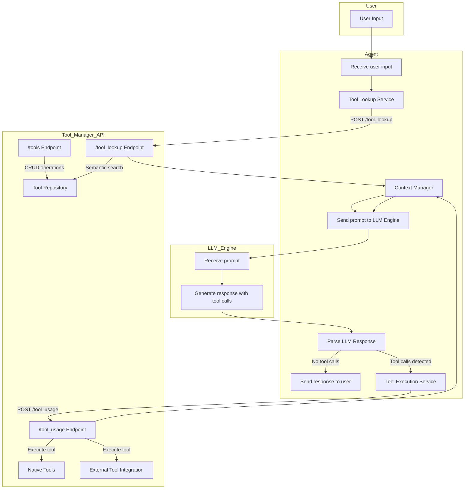

# Apollo Tech Agent

A LLM-powered agent system that connects to Ollama for local LLM inference and integrates with a Tool Manager API for tool discovery and execution.

## Architecture

This system implements the following architecture:



## Features

- **LLM Integration**: Connect to local Ollama instance for LLM inference, defaulting to the gemma3 model
- **Context Management**: Maintain conversation history and manage context window
- **Tool Integration**: Seamless integration with Tool Manager API for tool discovery and execution
- **FastAPI Server**: RESTful API to interact with the agent system

## Installation

### Prerequisites

- Python 3.9+
- Docker and Docker Compose (for containerized deployment)
- Ollama (for local LLM inference)
- Tool Manager API instance

### Local Development

1. Clone the repository:
```bash
git clone https://github.com/yourusername/apollo-tech.git
cd apollo-tech
```

2. Create a virtual environment and install dependencies:
```bash
python -m venv venv
source venv/bin/activate  # On Windows: venv\Scripts\activate
pip install -r requirements.txt
```

3. Set up environment variables (create a .env file):
```
TOOL_MANAGER_URL=http://localhost:8000
OLLAMA_BASE_URL=http://localhost:11434
DEFAULT_MODEL=gemma3
ENVIRONMENT=development
```

4. Run the application:
```bash
python main.py
```

### Docker Deployment

1. Ensure you have built the Tool Manager API image or update the docker-compose.yml file to point to the correct image.

2. Build and start the containers:
```bash
docker-compose up -d
```

## Usage

### API Endpoints

- **POST /process**: Process user input and get agent response
  ```json
  {
    "input": "Format this text to uppercase: hello world",
    "conversation_id": "optional-conversation-id"
  }
  ```

- **GET /conversation/{conversation_id}**: Get conversation history
- **DELETE /conversation/{conversation_id}**: Delete a conversation

### Example

```python
import requests

# Process user input
response = requests.post(
    "http://localhost:8080/process",
    json={"input": "Format this text to uppercase: hello world"}
)

result = response.json()
print(f"Response: {result['response']}")

# If conversation continues, use the returned conversation_id
conversation_id = result['conversation_id']
response = requests.post(
    "http://localhost:8080/process",
    json={"input": "Now count the words in: The quick brown fox jumps over the lazy dog", 
          "conversation_id": conversation_id}
)
```

## Adding New Tools

Tools are managed through the Tool Manager API. See the Tool Manager API documentation for details on registering and using tools.

## Environment Variables

- `TOOL_MANAGER_URL`: URL of the Tool Manager API (default: http://localhost:8000)
- `OLLAMA_BASE_URL`: URL of the Ollama API (default: http://localhost:11434)
- `DEFAULT_MODEL`: Default LLM model to use (default: gemma3)
- `HOST`: Host to bind the server to (default: 0.0.0.0)
- `PORT`: Port to bind the server to (default: 8080)
- `ENVIRONMENT`: Environment mode (development/production)

## License

[MIT License](LICENSE)